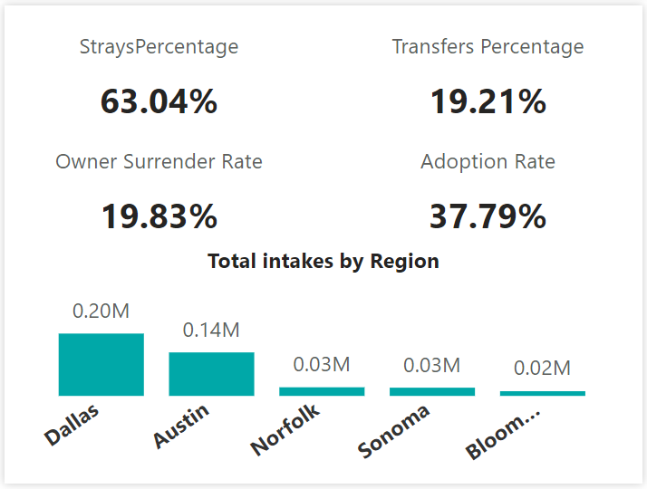

<div>

> Hello world! This is the project’s summary that describes the project, plain and simple, limited to the space available: <br>
> A comprehensive analysis of the factors influencing animal intakes and outcomes in shelters and centers distributed among five regions across the United States.<br>These factors include animal gender, type, and breed as well as socio-economic indicators like population, per capita income and unemployment rate.<br>
**[PROJECT PHILOSOPHY](#project-philosophy) • [PROTOTYPING](#prototyping) • [TECH STACKS](#stacks) • [IMPLEMENTATION](#demo) • [HOW TO RUN?](#run)**

</div> 
  

<br><br>

<!-- project philosophy -->

<a  name="philosophy" ></a>


> A python based ETL project that would extract, transform data from different web sources and load them into a tabular database (PostgreSQL) in an attempt to provide a full scope analytical understanding of animals journeys in US shelters. 

<br>

  

### User Types

 

1. Data Engineers.
2. Data Analysts.
3. Pet Adopters and Foster Families.
4. Regional Animal Welfare Organizations.
5. Veterinarians.
  

<br>

  

### User Stories

  
1. As a Data Engineer:<br>
	I want to automatically scrape various economic indicators from reputable sources so that our dataset is always up-to-date.<br>
	I want to integrate different data sources seamlessly.
	Ensure fault tolerance in our data pipelines, so that potential failures don't interrupt our analyses.
2. As an Analyst:<br>
	I want to query the database.<br>
	I want to visualize the data using Power BI.
3. As a Pet Adopter or a Foster Family:<br>
	I want to access a dataset that provides information on specific animals availability, behaviors, and characteristics to ensure proper care.<br>
	I want to know about available animals for fostering and temporary care.
4. As a Regional Animal Welfare Organization:<br>
	I want to oversee and coordinate animal adoption processes and welfare efforts at a regional level.<br>
	I want to assess the overall welfare of animals in the region and to allocate resources effectively.
5. As a Veterinarian:<br>
	I want to understand trends in animal deaths and euthanasia rates.<br>
	I want to coordinate with shelters or rescue organizations.


<br><br>

<!-- Prototyping -->


> We have designed our projects to webscrape, through an ETL project and including it in a PowerBI Sample Dashboard, 


### Logger File

  
| app.log |
| -----------------|
| |


### Data Flow Diagrams

  
| Schema Diagram |
| ---------------|
| |
 

  
<br><br>


<!-- Tech stacks -->

<a  name="stacks"></a>


<br>
Animal Intakes and Outcomes Analysis is created using the following technologies:

## Frontend

Interactive PowerBI Dashboard:
A central dashboard where viewers can view:

1. Animal Characteristics and Socio-economic Indicators:<br> Graphs, charts and visualizations displaying animal traits and key socio-economic metrics over time.
2. Interactive filters:<br> Options to filter data by date, region, or specific animal features for customized views.


  

<br>

  

## Backend

1. API Integration and Web scraping.
2. ETL Pipeline: using python and pandas, raw data is extracted, transformed into a usable format and loaded into postgreSQL database.
3. Database: Schema Design - Indexing - Data Integrity - Backup & Recovery. 


  
<br>

<br>

  

<!-- Implementation -->

<a  name="Demo"  ></a>


  

<br>

  


### Report Screenshots

| Home Page |
| ----------|
| |
 

<br>

| Overview |
| ----------|
| | 


 <br> 
  
| Adoption Analysis |
| ----------|
| | 


  
<br>

| Socio-economic Analysis |
| ------------------------|
| | 


<br> 
  

| Summary Analysis |
| -----------------|
| | 


<br> 
  
| Available for Adoption |
| -----------------------|
| | 


<br>

#### Toolboxes

| In Overview Page | In Adoption Analysis Page | In Socio-economic Analysis Page |
| ---------| ---------| ---------|
| |||

<br>

| Report Video Recap |
| -------------------|
|[] |


<br><br>
<br><br>


<!-- How to run -->

<a  name="run"  ></a>

  

> To set up **Animal Intakes and Outcomes Analysis** follow these steps:

### Prerequisites


**Hardware & Software**:

-   A computer/server with sufficient RAM and processing power.
-   Operating system: Linux (preferred for production) or Windows.
-   Required software: Python (3.x), PostgreSQL, Git (for version control).
  
  

**Dependencies**:

-   Install the necessary Python libraries: `pandas`, `requests`, `numpy`, `BeautifulSoup`, `psycopg2`, `openai`.
-   Install database connectors/drivers for PostgreSQL.
  

### **Setting Up the Environment**:

**Clone the Repository**:


```sh

git clone https://github.com/ola-smaha/FSD_Final_Project_2023.git

```

  
**Set Up the Database**:

-   Start the PostgreSQL server.
-   Create a new database and user with the appropriate permissions.
-   Run any initialization scripts to set up tables or initial.

### **Running the Backend**:

**Start the Data Ingestion & ETL Process**:
`python etl_script.py`

You should be able to check the app.log file to see the ETL work.

As for the dashboard access: Please use [this link](https://app.powerbi.com/view?r=eyJrIjoiYzQwOTIwYmItZGQzOS00ZWVmLWI2YjYtYjQyODRjMGFmYjFiIiwidCI6IjJhZDk2OTM0LTQzZTUtNDFjMi05NzYxLWYzMzVmZTIxNGNjMyIsImMiOjl9) to access your data.
